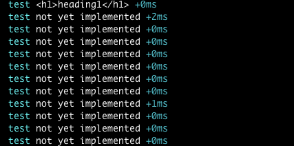

# What is a learning challenge?

* __Learn by reverse-engineering__: You will be asked to implement your own _reduced_ version of a particular tool or library.
* __Work in groups__: You will most likely to succeed if you work together with your classmates in small teams. 
* __Visualize by screenshots__: You will take and submit screenshots to visually demonstrate that you've learned a topic, thereby fulfilling a learning challenge.
* __Flipped classroom__: You will do your learning __not__ in the classroom.

# Warmup: html-generator

<code>html-gen</code> is a small library providing a set of helper methods for generating HTML structures.

```javascript
	var html = require('./lib.js')
	html.generateHeading1('some heading text')
	
	// --> <h1>some heading text</h1>
```

## Prerequisites

* Have brought a laptop
* Have installed [Node.js](http://nodejs.org/)
* Have installed a text editor (e.g., [Sublime Text](http://www.sublimetext.com/)) for writing code
* Have created a Github account

## Github Repository

<a href="https://github.com/ucdd2-sp15/ucdd-htmlgen" class="btn btn-info">https://github.com/ucdd2-sp15/ucdd-htmlgen</a>

<code>lib.js</code> is where all the library methods are implemented. Currently, only one method has been implemented.

<code>test.js</code> is a test script that invokes each of the library methods and print the return value of each method as a debug message.



<code>README.md</code> has instructions on how to run <code>test.js</code>.

## Deliverables

1. Have forked [ucdd-htmlgen](https://github.com/ucdd2-sp15/ucdd-htmlgen)
2. Have checked out your own fork locally on your machine to work on
3. Have implemented at least __FIVE__ of the unimplemented functions in <code>lib.js</code>
4. Have run <code>test.js</code> and made sure debug outputs are correct
5. Have committed your implementation and pushed to your Github account
6. Have made a pull request to source repository

## Screenshots
Take a screenshot to visually document and demonstrate your accomplishment of each deliverable. 

* __What screenshots to take?__ Make your own decision (or exchange ideas with other classmates) on what screenshots make sense.
* __How to submit screenshots?__ For now, save your screenshots. Next, in today's hackathon, we will work together to build a website to post your screenshots.
