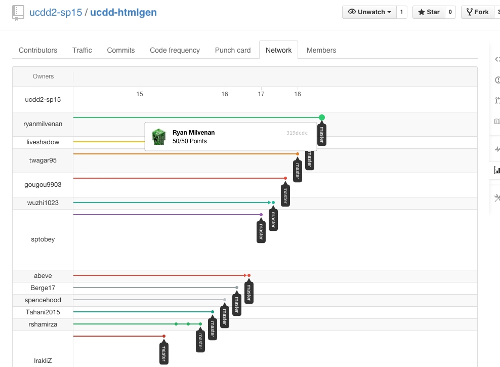
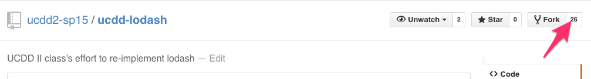

Your learning challenge this week has two parts. 

First, for team co-learning, the topic will be [Jade](http://jade-lang.com/), arguably the most popular template engine for Node. You will learn about Jade by building some basic features of our own knockoff called <code>ucdd-jaded</code>. Also, you will try to fix [this bug](https://github.com/ucdd2-sp15/people/issues/10) of the [People](https://github.com/ucdd2-sp15/people) website. This bug can be traced back to a Jade template file (index.jade).

Second, for individual learning, continue to develop the <code>ucdd-lodash</code> library to enhance your Javascript knowledge.

# Team Learning (50 points)

## Github Repository

<code>ucdd-jaded</code>

<a href="https://github.com/ucdd2-sp15/ucdd-jaded" class="btn btn-info">https://github.com/ucdd2-sp15/ucdd-jaded</a>

The skeleton code contains five test cases. Initially, only the first test case is working. Your team needs to work together to get all the test cases working.

## Milestones

1. Have gotten <code>test2</code> to work (10 point)
1. Have gotten <code>test3</code> to work (10 point)
1. Have gotten <code>test4</code> to work (10 point)
1. Have gotten <code>test5</code> to work (10 point)
1. Have discussed and come up with a solution for [this bug](https://github.com/ucdd2-sp15/people/issues/10) (10 point)

## Due
11:59pm, Friday

## Time and Location

Each team decides on a time and location to meet before the submission deadline.

## Procedure

1. The team leader should create a fork from [ucdd2-sp15/ucdd-jaded](https://github.com/ucdd2-sp15/ucdd-jaded).
2. Each team member should create a fork from this team's fork.
3. Everyone should work on a separate fork to implement and contribute to at least ONE test case. If your team has more members than there are test cases, some can work on the same test case. The bottom line is that everyone must contribute something.

## Submission

Individual members should first submit pull requests to the team leader's fork. After mering all the pull requests from other team members, the team leader should make a single pull request to [ucdd2-sp15/ucdd-jaded](https://github.com/ucdd2-sp15/ucdd-jaded). In the pull request message, the team leader should list the names of the team members and also write down the points the team has earned.

Use the following Markdown template in the pull request message.

```
# Team members
Who?
Who?
Who?
Who?

# Score
?/50

# Meeting Location
where?

# Meeting Time
when? how long?

# Bug
why? How to fix?

```

## Absence
People who fail to show up and participate in a team learning session will not earn any point from this part.

# Individual Learning (50 points)

More functions to reverse-engineer!!

## Github Repository

<code>ucdd-lodash</code>

<a href="https://github.com/ucdd2-sp15/ucdd-lodash" class="btn btn-info">https://github.com/ucdd2-sp15/ucdd-lodash</a>

## Development

You should have created your own fork already from last week's homework. In the local copy of your fork, pull the new part2 files by running

	$ git pull

You should see these two files added:

* <code>lib/ucdd-lodash.part2.js</code>: five more library functions to implement
* <code>test/ucdd-lodash.part2.test.js</code>: code to test these functions

## Milestones
1. Have implemented <code>range</code> (10 points)
1. Have implemented <code>pick</code> (10 points)
1. Have implemented <code>some</code> (10 points)
1. Have implemented <code>every</code> (10 points)
1. Have implemented <code>find</code> (10 points)

## Due
11:59pm, Sunday

## Submission

You do not need to make a pull request from your fork. You just need to make sure you commit your code and push this commit to your own Github fork. We will assume your most recent commit prior to the deadline is your submission.


Github provides a nice visualization of all the forks and commits as a _Network Graph_. For example, last week's submissions for <code>html-gen</code> are already visible in this repo's network graph, shown below.



You can see Ryan reported to have earned 50/50 points! You can also see a good majority of students had their commits at least a couple days before the deadline, a very promising sign!


For this week, the network graph can be accessed [here](https://github.com/ucdd2-sp15/ucdd-lodash/network). Or you can click on the number next to the fork button, like below.



If you are able to see your activities in the graph, you are all set!

# Grading

We will use a honor system in which you will self-report the points you believe you have earned. For the team learning part, the team leader reports the points earned in the pull request message. For the individual learning part, you report the points you've earned in the last commit message prior to the deadline.

Each week, the grader for this class will take a random sample of the submissions to check for consistency to ensure fairness and promote honesty.