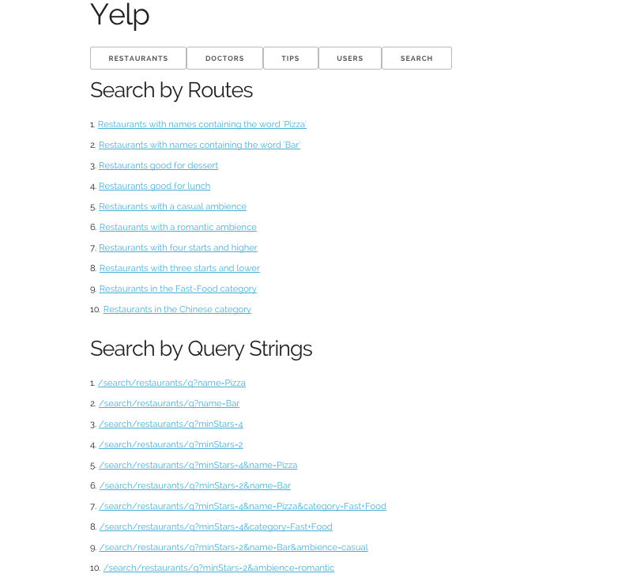

Your learning challenge this week will be about [Express](http://expressjs.com/), which calls itself a fast, unopinionated, minimalist web framework for Node.js. For the teaming learning component, your objective is to port the set of Jade templates you've developed for the [Yelp hackathon](../../hackathons/yelp) to the Express framework, so that detail pages about individual items can be served dynamically. For the individual learning component, your objective is to develop a _search_ plugin for this site.

# Team Learning (50 points)

## Objectives

1. Implement the TODO's in the template files in `views/` for linking to individual restaurants, doctors, tips, and users.
1. Port the templates you made from the hackathon from Wintersmith to Express.
1. Implement the TODO's in `app.js` to return a specific restaurant, doctor, tip, or user by its Ids.

## Github Repository

<a href="https://github.com/ucdd2-sp15/yelp-express" class="btn btn-info">https://github.com/ucdd2-sp15/yelp-express</a>

## Milestones

1. Have gotten the skeleton code running on every team member's machine (10 points)
1. Have completed the `restaurants` listing and detail pages (10 points)
1. Have completed the `doctors` listing and detail pages (10 points)
1. Have completed the `tips` listing and detail pages (10 points)
1. Have completed the `users` listing and detail pages (10 points)

<span class='btn btn-danger'>BONUS</span>
Get the site hosted on some server that can be viewed publicly. (10 points)

## Due
11:59pm, Friday

## Time and Location

Each team decides on a time and location to meet before the submission deadline.

## Submission

Same deal. The team leader makes a fork each team member will in turn create another fork from. THe team leader then accepts pull requests from team members, merge them, and make a single, combined pull request to the original repository (i.e., [ucdd2-sp15/yelp-express](https://github.com/ucdd2-sp15/yelp-express)).

Use the following Markdown template in the pull request message.

```
# Team members
Who?
Who?
Who?
Who?

# Score
?/50

# Bonus
?/10
which url?

# Meeting Location
where?

# Meeting Time
when? how long?

```

# Individual Learning (50 points)

Develop a richer set of search functions that are just not possible with Wintersmith. The search functions are defined in `search.js` as a plugin. The skeleton code contains a bunch of hardcoded fake results. Your learning objetive is to make them real by implementing the neccessary search logic using Javascript. You are encouraged to use Lodash functions such as `_.find` or `_.filter`.

_Why not using a database?_ Please be patient. We will do just that next.

## Github Repository

Your own fork of `yelp-express`

<a href="https://github.com/ucdd2-sp15/yelp-express" class="btn btn-info">https://github.com/ucdd2-sp15/yelp-express</a>

## Test Cases

There are a total of 6 functions in `search.js` you need to implement. On the `Search` tab, you will see a list of 20 test queries. You earn 2.5 points for each one you got working. 



_How can I check these test cases automatically?_  For this week, you need to manually look at the results to see if there are correct. You may soon feel it's a bit tedious. Next week, you will learn about using [Mocha](http://mochajs.org/) for test automation.

## Milestones

* Search by Routes (25 points)
* Search by Query Strings (25 points)

## Due
11:59pm, Sunday

## Submission

* You do not need to make a pull request from your fork. You just need to make sure you commit your code and push this commit to your own Github fork. We will assume your most recent commit prior to the deadline is your submission. 
* Remember to include the points you've earned in the commit message.
* You do not need to get the site live on a public server.

