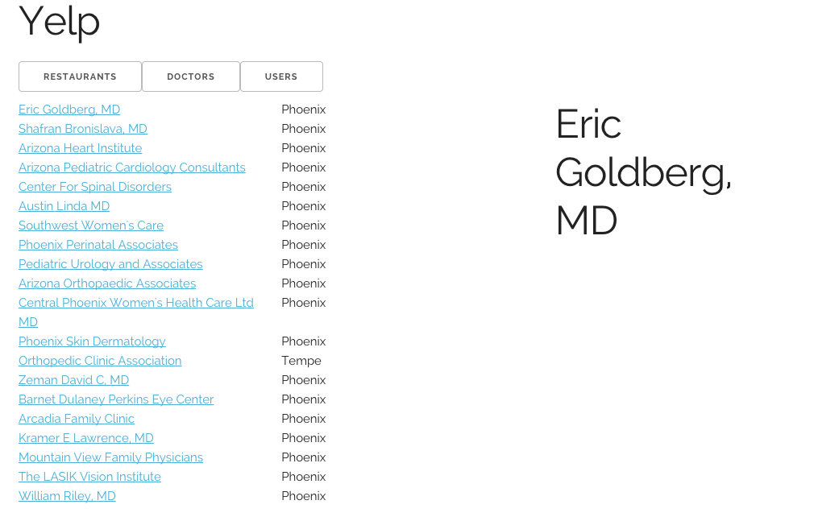
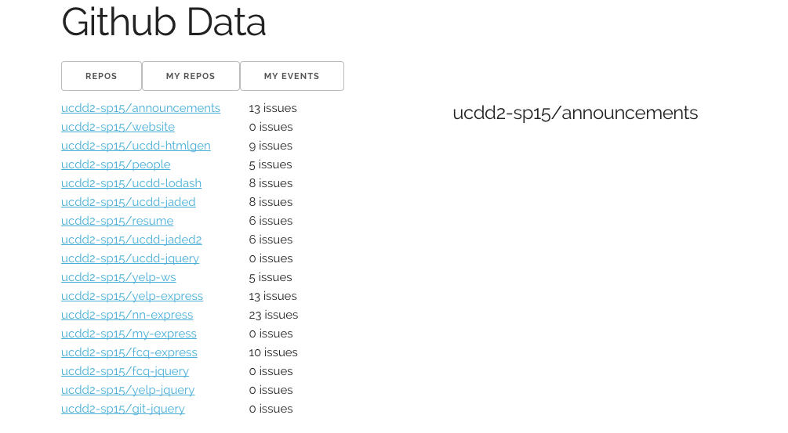

Your learning challenge this week will be about [jquery](https://www.jquery.com/). For the team learning component, your objective is to re-implement the Yelp site, using [$.get()](http://api.jquery.com/jquery.get/) to dynamically pull data in and using DOM insertion (i.e., [.html()](http://api.jquery.com/html/)) to to display the data. For the individual learning component, your objective is to re-implement the Github site you worked on last week, but instead of grabbing data from a MongoDB server, you will be pulling in data using the [Github API](https://developer.github.com/v3/).

What you are building right now is a simple version of the so-called [single-age app](http://en.wikipedia.org/wiki/Single-page_application). Think about how this differs from the static site generator (Wintersmith) and the server-side app (Express) in terms of pros and cons.

# Team Learning (50 points)

## Objectives

Build a single-page app for Yelp

## Github Repository

<a href="https://github.com/ucdd2-sp15/yelp-jquery" class="btn btn-info">https://github.com/ucdd2-sp15/yelp-jquery</a>

The skeleton site is hosted at [http://ucdd2-sp15.github.io/yelp-jquery](http://ucdd2-sp15.github.io/yelp-jquery) and looks like below.



The functionality for listing and viewing doctors has been implementd. Click on the `DOCTORS` tab and see what happens. Read the code in [contents/js/doctor](https://github.com/ucdd2-sp15/yelp-jquery/tree/master/contents/js/doctor) and learn from this working example.

## Learning Resources

* [jQuery get()](http://api.jquery.com/jquery.get/)
* [jQuery html()](http://api.jquery.com/html/)

## Milestones

- list restaurants (10 points)
- view a restaurant (10 points)
- list users (10 points)
- view a user (10 points)
- use the jade templates you built for Yelp-Express (10 points)

## Due
11:59pm, Friday

## Teaming

<span class='btn btn-danger'>IMPORTANT</span> You will be working with a new team. You would have a different set of jade templates from previous Yelp Express challenge. Decide among the team whose or which combination of templates you want to migrate to this new app.

## Time and Location

Each team decides on a time and location to meet before the submission deadline.

## Submission

The team leader will again take individual teams' pull requests, merge them, and make a single pull request to the original repository, which is [ucdd2-sp15/yelp-jquery](https://github.com/ucdd2-sp15/yelp-jquery).

Use the following Markdown template in the pull request message.

```
# Team members
Who?
Who?
Who?
Who?

# Score
?/50

# URL

which gh-page url to access your team's single-page app?

# Meeting Location
where?

# Meeting Time
when? how long?

```

# Individual Learning (50 points)

Create a single-page app for the Github data

## Github Repository

<a href="https://github.com/ucdd2-sp15/git-jquery" class="btn btn-info">https://github.com/ucdd2-sp15/git-jquery</a>

The skeleton site is deployed at [http://ucdd2-sp15.github.io/git-jquery/](http://ucdd2-sp15.github.io/git-jquery/). The `REPOS` button is functional. Click on it and you should see something like below.



## Milestones

* View Repo in `#details` (at least 15 fields) (10 points)
* List My Repos in `#list` (at least 5 fields per item) (10 points)  
* View My Repo in `#details` (at least 15 fields) (10 points)
* View My Events in `#list` (at least 5 fields per item) (10 points)
* Deploy to gh-pages (10 points)
    
## Due
11:59pm, Sunday

## Submission

* Make your own fork of [git-jquery](https://github.com/ucdd2-sp15/git-jquery)
* You do not need to make a pull request from your fork. You just need to make sure you commit your code and push this commit to your own Github fork. We will assume your most recent commit prior to the deadline is your submission. 
* Deploy the site to Github pages (similar to previous Wintersmith-related challenges)
