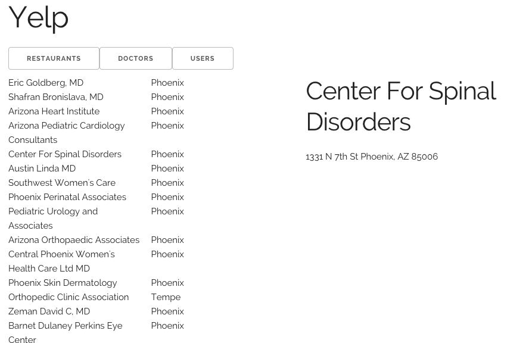

The topic of this week's learning challenge is [ReactJS](http://facebook.github.io/react/index.html).For the team learning component, the objective is to re-implement the Yelp site, again, using the ReactJS framework. A working skeleton code is provided for this.

For the individual learning component, the objective is to re-implement the API front-end site you worked on last week, using the ReactJS framework.


# Team Learning (50 points)

## Objective

Build a single-page app for Yelp, using ReactJS

## Github Repository

<a href="https://github.com/ucdd2-sp15/yelp-react" class="btn btn-info">https://github.com/ucdd2-sp15/yelp-react</a>

The skeleton site is hosted at [http://ucdd2-sp15.github.io/yelp-react](http://ucdd2-sp15.github.io/yelp-react) and looks like below.



The functionality for listing and viewing doctors has been implementd. Click on the `DOCTORS` tab and see what happens. Read the code in [contents/js/doctor](https://github.com/ucdd2-sp15/yelp-react/tree/master/contents/js/doctor) and learn from this working example.

It would be a good idea to compare the code to those of [yelp-jquery](https://github.com/ucdd2-sp15/yelp-jquery) that you've seen before. You may have lost track of how many times you have to work with Yelp so far. The assumption is that you should be able to reuse a lot of knowledge and code you've accumulated in the past.
 
## Milestones

- list restaurants (10 points)
- view a restaurant (10 points)
- list users (10 points)
- view a user (10 points)
- reuse/port the templates you built before (10 points)

## Due
11:59pm, Friday

## Teaming

You will be working with the same team.

## Time and Location

Each team decides on a time and location to meet before the submission deadline.

## Submission

The team leader will again take individual teams' pull requests, merge them, and make a single pull request to the original repository, which is [ucdd2-sp15/yelp-react](https://github.com/ucdd2-sp15/yelp-react).

Use the following Markdown template in the pull request message.

```
# Team members
Who?
Who?
Who?
Who?

# Score
?/50

# URL

Which gh-page url to access your team's "reactive" single-page app?

# Meeting Location
Where?

# Meeting Time
When? How long?

```  

# Individual Learning (50 points)

## Objective

Port the web app you built for an API last week to ReactJS

## Github Repository

None is provided. You should start a new one your own. It should not be the same one you used last week.

## Milestones

* Got API authentication to work (either client-side or server-side) (10 points)
* Ported one `listing` feature to ReactJS (10 points)
* Ported one `showing details` feature to ReactJS  (10 points)
* Ported another `listing` feature to ReactJS  (10 points)
* Ported another `showing details` feature to ReactJS  (10 points)

## Due

11:59pm, Sunday

## Submission

Add a post in [this issue](https://github.com/ucdd2-sp15/announcements/issues/22) to _announce_ your submission. Use the template below

```
# Name
who?

# Score
?/50

# ReactJS: Github

Which github url to access the source of the 'ReactJS' version of your app?

# ReactJS: Live Site

Which url to see your 'ReactJS' version of the app live?

# ReactJS: Screenshot

include a representative screenshot of your site here

# Original: Github

Which github url to access the source of the original version of your app?

# Original: Live Site

Which url to see your original version of the app live?

```