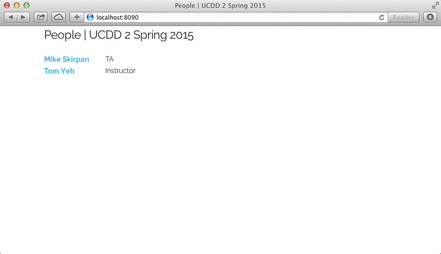
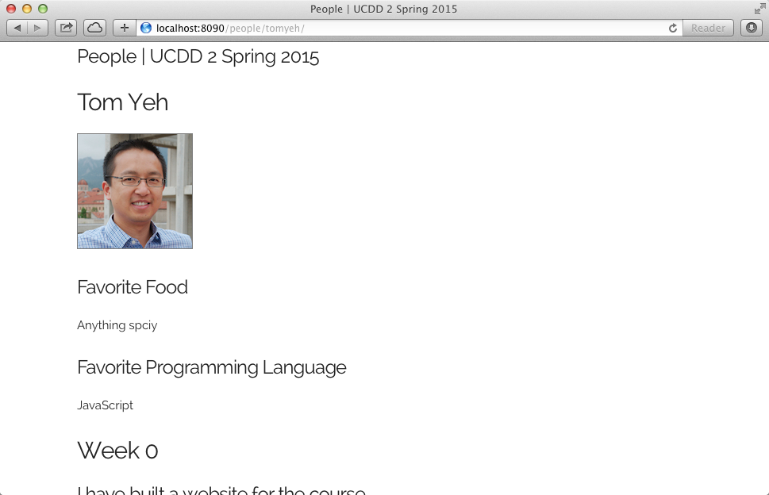

# Prototype

We have developed a prototype for this site using [Wintersmith](http://wintersmith.io/), a static website generator based on JavaScript. Currently, this prototype has a landing page that displays a list of individuals. Each link points to an individual's page showing some basic information about the individual.

|      |
| ---- |
|   | 

The Github repository for this site is 

<a href="https://github.com/ucdd2-sp15/people" class="btn btn-info">https://github.com/ucdd2-sp15/people</a>

# Specifications

* Every student in the class should have a page about the student
* The page should provide basic information about each student
* The page should visually document each student's learning challenge deliverables
* The landing page should show a complete list of links to everyone's page.

# Process

## Team

You will work in a team of four or five. The teaching staff will facilitate teaming. Each team will elect a leader. We recommend that the person who is most experienced with Github's fork/pull-request process should be elected as the leader.

## Fork

As a class, we will divide-and-conquer to get the site completed and achieve the hackathon's objectives. This divide-and-conquer will proceed in two levels.

First, at the level of teams, we will divide a class into several teams. Each team will make only one fork from the source repository. The team leader is responsible for making this fork.

Second, at the level of individuals, each team member will make a personal fork from the team's fork. In effect, each person will be working on his or her own fork of a fork.

## Pull

After your work is done, first, make a pull request to your team's fork. The team leader is responsible for accepting and merging this pull request.

After all the edits from individual forks are merged into your team's work, the team leader will make a final pull request to the source respository. Then, the teaching staff will merge each team's pull request.

Thorugh this two-step process, we hope to have everyone's page added to this website.

# Contents

## Personal Page

1. Create a new directory <code>contents/people/[your-name]</code> where <code>[your-name]</code> should be replaced by your real name.
2. Take a look at <code>contents/people/tomyeh</code>. You will find <code>index.md</code>. Use this file as an example. This is written using Markdown. Copy this file to your directory and start making changes.
3. Copy the screenshots you took earlier to this directory. Add references to these images in <code>index.md</code>.

## Landing Page

Once you've created a new directory under <code>contents/people</code> and the <code>index.md</code> file in the directory, this new page will be automatically detected by Wintersmith's build engine and a new link will be added to the landing page. You do not need to write any extra code for this to happen. You just need to check whether this does happen.

# Milestones

1. Have made a team's fork as a team
1. Have made your personal fork from the team's fork
1. Have previewed the skeleton website via your own computer's localhost.
1. Have created a new directory for yourself (e.g., <code>contents/people/[your-name]</code>) and create a file <code>index.md</code> in the directory
1. Have added some information about yourself
1. Have added a series screenshots about your learning challenges deliverables
1. Have previewed the updated website with your personal page
1. Have made a pull request to your team's fork
1. Have your pull request merged into your team's fork
1. Have everyone's personal fork merged into your team's fork
1. Have everyone's name to appear on the landing page in your team's fork
1. Have made a pull request from your team's fork to the class's repository