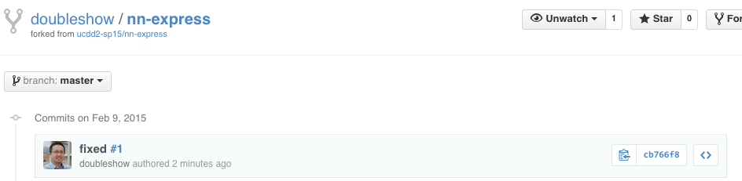

[NatureNet](http://www.nature-net.org/) is a research project [funded](http://nsf.gov/awardsearch/showAward?AWD_ID=1221513) by the [National Science Foundation](http://nsf.gov/index.jsp). It needs a better website, preferably powered by ExpressJS.

A skeleton site is at: [https://frozen-tor-4197.herokuapp.com/](https://frozen-tor-4197.herokuapp.com/note/list). There are many open [issues](https://github.com/ucdd2-sp15/nn-express/issues). Some are [bugs](https://github.com/ucdd2-sp15/nn-express/labels/bug) and some are [enhancements](https://github.com/ucdd2-sp15/nn-express/labels/enhancement). 10 of them are associated with the [hackathon](https://github.com/ucdd2-sp15/nn-express/milestones) milestone. 

How many can your team address in 150 minutes?

# Github

The Github repository for this site is at

<a href="https://github.com/ucdd2-sp15/nn-express" class="btn btn-info">https://github.com/ucdd2-sp15/nn-express</a>

# Data
This site's data are stored as three separate json files in `data`. The three files are `accounts.json`, `contexts.json`, and `notes.json`.

[Click here to see these JSON files on Github](https://github.com/ucdd2-sp15/nn-express/tree/master/data)

# Objective

Solve all the issues marked for the milestone named [hackathon](https://github.com/ucdd2-sp15/nn-express/milestones).

# Q/A

## NatureNet

* __What is NatureNet__? NatureNet is a citizen science project with a crowd-sourced design. The goal to increase motivation for participation and to identify creative ways in which people can contribute to sustainable bio-diversity at the Aspen Center for Environmental Studies (ACES).
* __Who are involved in this project?__ Three universities: University of North Carolina Charlotte (UNCC), University of Maryland Collge Park (UMD), and University of Colorado Boulder (CU). Tom Yeh, the professor teaching this course, is the Principal Investigator (PI) of CU's team. Jackie Cameron is a PhD student on the project. She is around today and can answer your question about the project.
* __Is the site going to be used at one point?__ Quite possibly. Rather than working on another fake site, we thought it would be more fun and meaningful to hack on a site for something real.

## Logistics

* __Who works on what?__ The work must be fairly distributed among the team members. The site's functionality is broken down into small, individual script files in [routes/](https://github.com/ucdd2-sp15/nn-express/tree/master/routes) and template files in [views/](https://github.com/ucdd2-sp15/nn-express/tree/master/views) to make it easy for concurrent development and to minimize conflicts.
* __How can I indicate that I've fixed an issue?__ Each time you've fixed an issue, make a commit. Suppose you've just fixed issue 1 and are ready to commit to your branch, write `fixed issue #1` in the commit message.

		$ git commit -a -m 'fixed #1'

	Github is clever and can automatically resolve #1 to issue 1. The fact that you've resolved #1 will be reflected in the commit history, like this:
	
		

* __Should the site go live?__ Yes. The team leader should publish the site to Heroku following this [instruction](https://devcenter.heroku.com/articles/getting-started-with-nodejs#prepare-the-app). You only need to do the [Set up](https://devcenter.heroku.com/articles/getting-started-with-nodejs#set-up) step and the [Deploy the app](https://devcenter.heroku.com/articles/getting-started-with-nodejs#deploy-the-app) step. Ask for help if you are stuck.

# Time

2.5 hours

# Team

Work together with the same team from the previous week.

# Procedure

Use the same two-level fork-pull procedure you've done a few times so far.

1. __Fork.__ The team leader creates a fork (i.e., team's fork).
1. __Fork.__ Each team member creates a fork of this team's fork.
1. __Work.__ The team distributes works fairly to individual members to do.
1. __Pull.__ Once done, each team member makes a pull request to the leader.
1. __Pull.__ The leader merges all the pull requests and then make a single pull request to the course's repository (i.e., [https://github.com/ucdd2-sp15/nn-express](https://github.com/ucdd2-sp15/nn-express)).

# Milestones

* [Issue 1](https://github.com/ucdd2-sp15/nn-express/issues/1) (5 points)
* [Issue 2](https://github.com/ucdd2-sp15/nn-express/issues/2) (5 points)
* [Issue 3](https://github.com/ucdd2-sp15/nn-express/issues/3) (5 points)
* [Issue 4](https://github.com/ucdd2-sp15/nn-express/issues/4) (5 points)
* [Issue 5](https://github.com/ucdd2-sp15/nn-express/issues/5) (5 points)
* [Issue 6](https://github.com/ucdd2-sp15/nn-express/issues/6) (5 points)
* [Issue 7](https://github.com/ucdd2-sp15/nn-express/issues/7) (5 points)
* [Issue 8](https://github.com/ucdd2-sp15/nn-express/issues/8) (5 points)
* [Issue 9](https://github.com/ucdd2-sp15/nn-express/issues/9) (5 points)
* [Issue 10](https://github.com/ucdd2-sp15/nn-express/issues/10) (5 points)

# Submission Template

Use the following template in the pull request message:

```markdown

# Team members
Who?
Who?
Who?
Who?

# Score
?/50

# URL
What Heroku URL to access this site? (e.g., https://frozen-tor-4197.herokuapp.com/)

```

