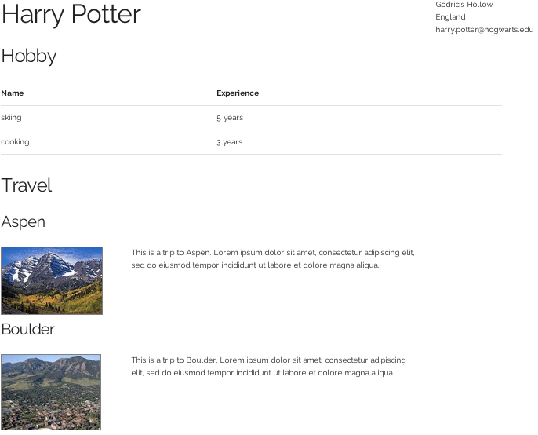

A skeleton site is at:

[http://ucdd2-sp15.github.io/resume/](http://ucdd2-sp15.github.io/resume/)

This site currently has some placeholder contents:



The Github repository for this site is at

<a href="https://github.com/ucdd2-sp15/resume" class="btn btn-info">https://github.com/ucdd2-sp15/resume</a>

# Objectives

Populate the site with real contents for the following sections:

* Personal Information 
* Work Experiences
* Education
* Portfolio
* Skills
* Honors
* References

# Specifications

* __Whose resume is this?__ The resume should be about a fictional person whose background is a synthesis of real data from all members of the team. For example, this fictional person may have A's work experiences, B's porfolio, C's skills, and D's education.
* __How real?__ Individually, all items on this resume should be real. Of course, taken together, the resume is fictional.
* __ What is the name of the person?__ A combination of team member's middle names.
* __Who works on what?__ The work must be fairly distributed among the team members. Each team member must be responsible for at least one section. Since there are more sections than team members, some team members may need to work on more sections.
* __Should images be used?__ Work Experiences and Portfolio sections must include relevant images. For other sections, use of images is encouraged but optional.
* __Should the site go live?__ Yes. The team leader should publish the site to [gh-pages](https://pages.github.com/) under his or her own account.
* __But, I don't want to host a madeup person's resume__? This is only temporary. In this week's homework, everyone will develop his or her own resume with all the sections filled with his or her real personal contents.

# Time

2 hours

# Team

Work together with the same team from the previous week.

# Hints

* Read `contents/hobby.json` and `templates/hobby.jade` to learn how the hobby section is made.
* Read `contents/travel.json` and `templates/travel.jade` to learn how the hobby section is made
* Read `templates/index.jade` to see how different sections are brought together.

# Procedure

Use the same two-level fork-pull procedure you've done a few times so far.

1. __Fork.__ The team leader creates a fork (i.e., team's fork).
1. __Fork.__ Each team member creates a fork of this team's fork.
1. __Work.__ The team distributes sections fairly to individual members to work on.
1. __Pull.__ Once done, each team member makes a pull request to the leader.
1. __Pull.__ The leader merges all the pull requests and then make a single pull request to the course's repository (i.e., [https://github.com/ucdd2-sp15/resume](https://github.com/ucdd2-sp15/resume)).

# Milestones

* Personal Information (5 points)
* Work Experiences (10 points)
* Portfolio (10 points)
* Education (5 points)
* Skills (5 points)
* Honors (5 points)
* References (5 points)
* Published to gh-pages (5 points)

# Submission Template

Use the following template in the pull request message:

```markdown

# Team members
Who?
Who?
Who?
Who?

# Score
?/50

# URL
What URL to access this site?

```

# Useful Resources

http://naltatis.github.io/jade-syntax-docs/
