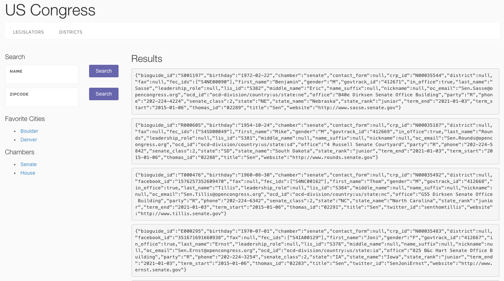

[Sunlight Foundation](http://sunlightfoundation.com/) is a nonpartisan nonprofit that advocates for open government globally and uses technology to make government more accountable to all. It offers free [APIs](http://sunlightfoundation.com/api/) for accessing a variety of government data. The objective of today's hackathon is to build an interactive web app for these APIs using JQuery.

A skeleton site has been developed for your team to build upon.



View this site live at [http://ucdd2-sp15.github.io/sunlight/](http://ucdd2-sp15.github.io/sunlight/)

# Github

The Github repository for this site is at

<a href="https://github.com/ucdd2-sp15/sunlight" class="btn btn-info">https://github.com/ucdd2-sp15/sunlight</a>

# API

We will focus on the [Congress API](https://sunlightlabs.github.io/congress/) for this hackathon. The skeleton site currently uses only the [legislators](https://sunlightlabs.github.io/congress/legislators.html) method of the API. 

# Code Overview

Here is a brief overview to help you understand the skeleton code.

In `contents/legislators`

* `index.js` defines a number of search functions, each of which calls an API method with the right parameters, gets data, retrieves a Jade template (i.e., `list.jade`), renders the data as HTML using the template, and assigns the HTML to the `#list` element on the page.
* `list.jade` is a template for rendering a list of results. Currently, it just prints out each result as a JSON string.
* `ui.jade` defines a search interface for this API method. Use this as an example for creating search interfaces for other API methods. 

In `contents/districts`, you will see the same three files: `index.js`, `list.jade`, and `ui.jade`. They are meant for the [districts API](https://sunlightlabs.github.io/congress/districts.html). But the code is incomplete.

In `contents/js/app.js`, you can find code for loading the right search interface when a user clicks on one of the navigation menu item.

```javascript
$( "#legislators" ).on( "click", function( event ) {
    legislators.load()
})

```

# Objectives

* The interfaces for the `legislators` and `districts` API methods are only partially complete. You will need to complete them.
* Use the same code structure to create interfaces for THREE additional API methods. This means you will need to create a new folder for each new API method, and in each folder add `index.js`, `list.jade`, and `ui.jade`. Choose any three from the list on [this page](https://sunlightlabs.github.io/congress/) that you are interested in. 

# Q/A

## Logistics

* __Who works on what?__ The work must be fairly distributed among the team members. One possible way to distribute work is for each team member to be responsible for an API method.
* __Should the site go live?__ Yes. Please push you site to the gh-pages like you did in previous wintersmith + jquery works.

# Time

2.5 hours

# Team

Work together with the same team from the previous week. Use the same two-level fork-pull procedure you've done many times.


# Milestones

* Have built an interface for the `legislators` API method (10 points)
* Have built an interface for the `districts` API method (10 points)
* Have built an interface for the 3rd API method (10 points)
* Have built an interface for the 4th API method (10 points)
* Have built an interface for the 5th API method (10 points)

# Demo

<span class="btn btn-danger">NEW</span> 

You will do demo twice.

1. After your team has pushed the site live to gh-pages and before making a joint pull request, you must do a demo of your site to one of the teaching staff. Each team member presents the page he or she has worked on.
1. For the last 20 minutes of the class, each team will present to the entire class.

# Submission Template

Use the following template in the pull request message:

```markdown

# Team members
Who?
Who?
Who?
Who?

# Score
?/50

# URL
What gh-pages URL to access this site?

```

