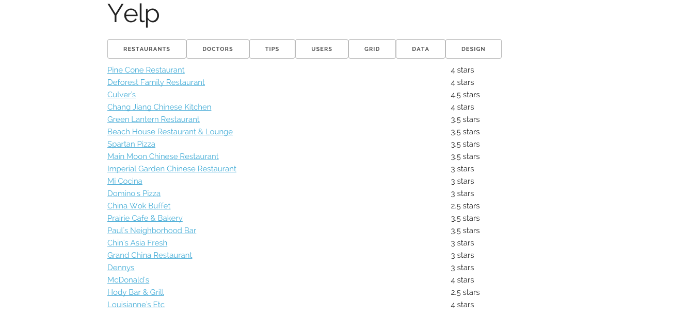
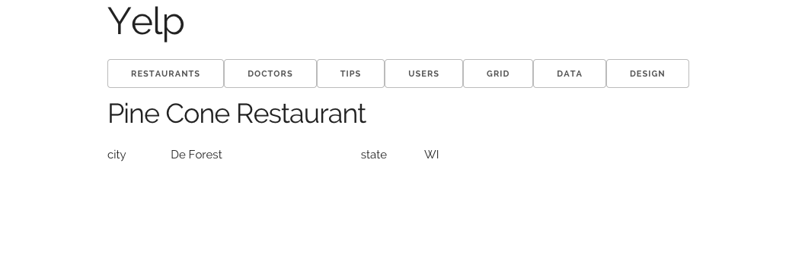

A skeleton site is at: [http://ucdd2-sp15.github.io/yelp-ws/](http://ucdd2-sp15.github.io/yelp-ws/)


[List of Restaurants](http://ucdd2-sp15.github.io/yelp-ws/restaurants.html)



[Detail of a Restaurant](http://ucdd2-sp15.github.io/yelp-ws/view/restaurant.html)




# Github

The Github repository for this site is at

<a href="https://github.com/ucdd2-sp15/yelp-ws" class="btn btn-info">https://github.com/ucdd2-sp15/yelp-ws</a>

# Data
This site currently hosts four types of data: restaurants, doctors, tips, and users. They are stored in the `contents/data` folder as static json files.

[Click here to see these JSON files on Github](https://github.com/ucdd2-sp15/yelp-ws/tree/master/contents/data)

# Objectives

Create design sketches for listing restaurants, doctors, tips, and users as well as for viewing a specific item. 

Implement mockups of these sketches by modifying the following jade template files:

* List Restaurants: `listRestaurants.jade`
* List Doctors: `listDoctors.jade`
* List Tips: `listTips.jade`
* List Users: `listUsers.jade`
* View a Restaurant: `viewRestaurant.jade`
* View a Doctor: `viewDoctor.jade`
* View a Tip: `viewTip.jade`
* View a User: `viewUser.jade`

# Q/A

## Design 

* __How should I make sketches?__ Use pen and pencials. If you have a favorite mockup tool, you can use it too.
* __How good should these sketches be?__ Something reasonable and quick.
* __How should I submit these sketches?__ Take photos of your sketches using a camera. Or take a screenshot if you use a mockup tool. Add the images to the [Design](http://ucdd2-sp15.github.io/yelp-ws/design/) page.
* __How should I implement the layout in my design?__ Take a look at the [Grid](http://ucdd2-sp15.github.io/yelp-ws/grid.html) page for examples.
* __Should images be used?__ Yes. The pages for listing and viewing restaurants, doctors, and users must include photos (e.g., a photo of the restaurant). Photos are optional for tips. The paths to the images can be hardcoded.

## Logistics

* __Who works on what?__ The work must be fairly distributed among the team members. Each team member must be responsible for at least one or two pages.
* __Should the site go live?__ Yes. The team leader should publish the site to [gh-pages](https://pages.github.com/) under his or her own account.

# Time

2 hours

# Team

Work together with the same team from the previous week.

# Procedure

Use the same two-level fork-pull procedure you've done a few times so far.

1. __Fork.__ The team leader creates a fork (i.e., team's fork).
1. __Fork.__ Each team member creates a fork of this team's fork.
1. __Work.__ The team distributes sections fairly to individual members to work on.
1. __Pull.__ Once done, each team member makes a pull request to the leader.
1. __Pull.__ The leader merges all the pull requests and then make a single pull request to the course's repository (i.e., [https://github.com/ucdd2-sp15/yelp-ws](https://github.com/ucdd2-sp15/yelp-ws)).

# Milestones

* Design sketches (10 points)
* List Restaurants (5 points)
* List Doctors (5 points)
* List Tips (5 points)
* List Users (5 points)
* View a Restaurant (5 points)
* View a Doctor (5 points)
* View a Tip (5 points)
* View a User (5 points)


# Submission Template

Use the following template in the pull request message:

```markdown

# Team members
Who?
Who?
Who?
Who?

# Score
?/50

# URL
What URL to access this site?

```

# Useful Resources

http://naltatis.github.io/jade-syntax-docs/
